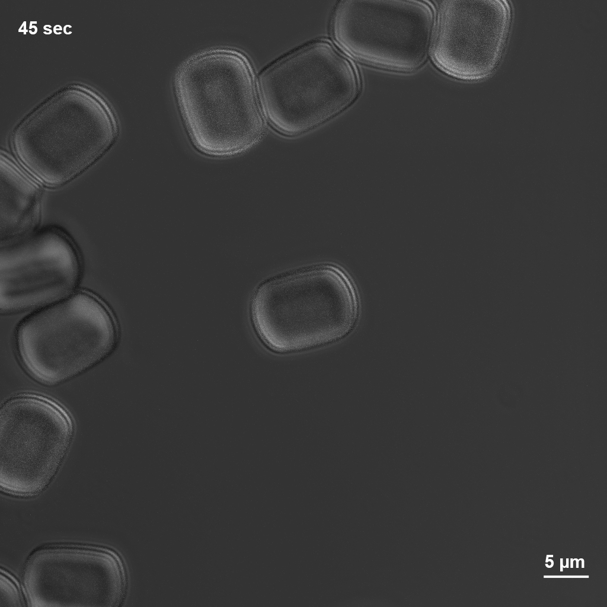
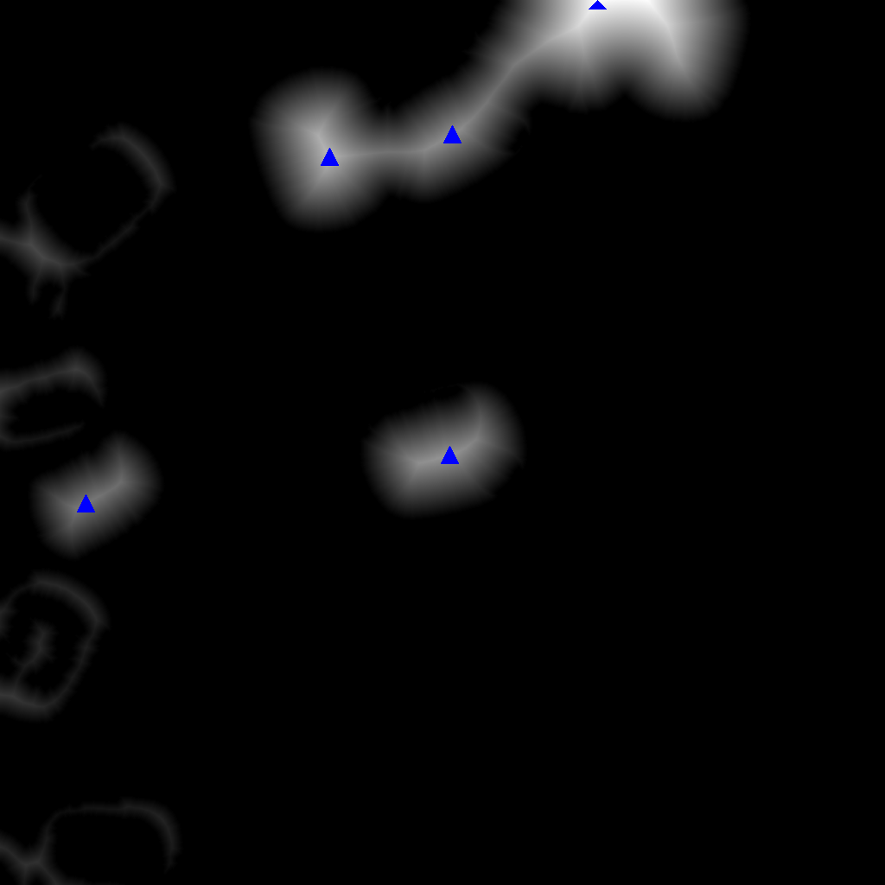
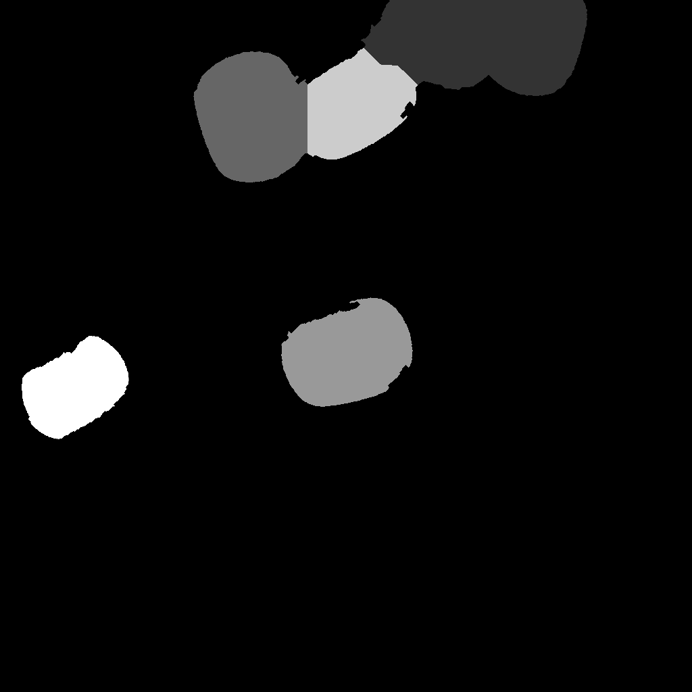
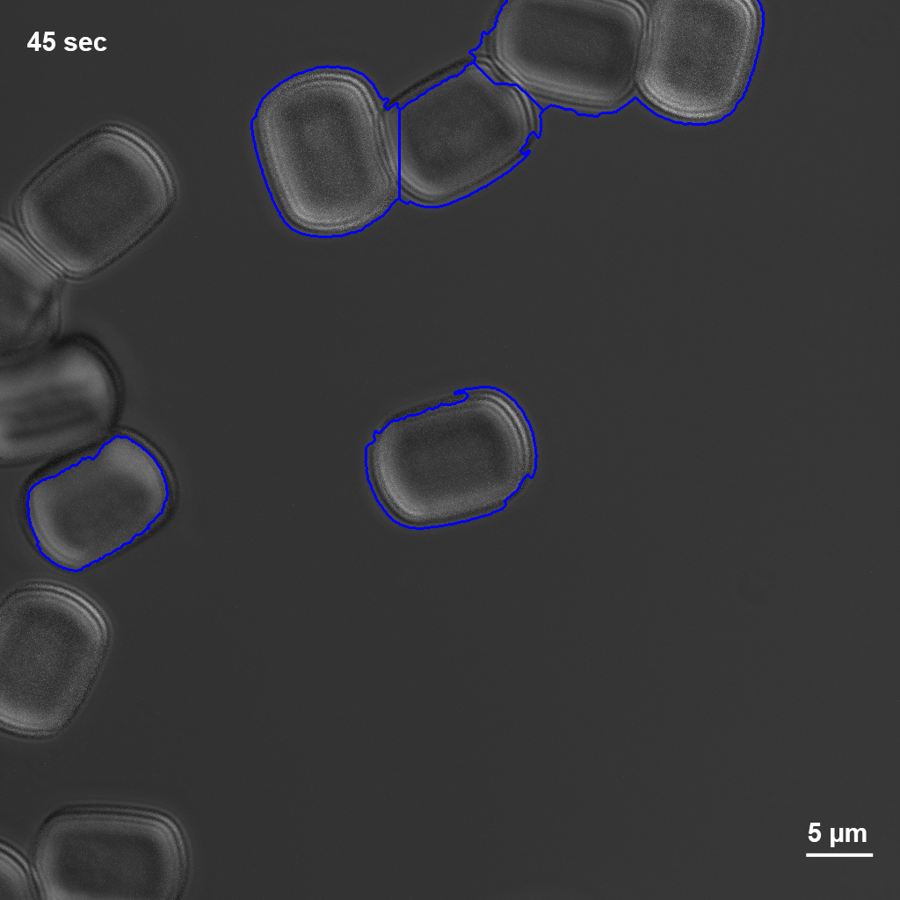
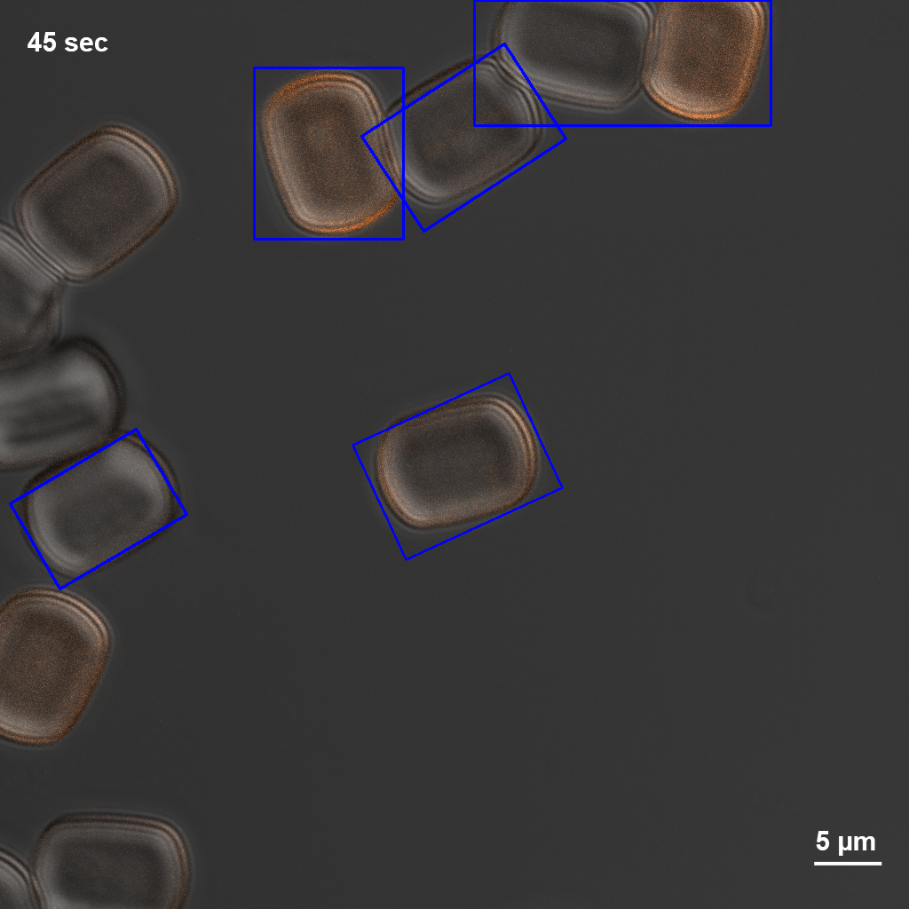
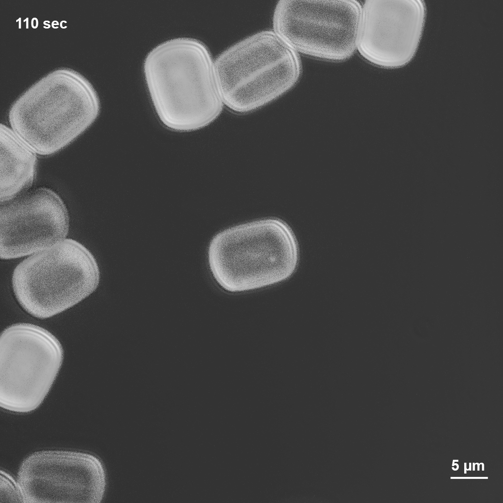
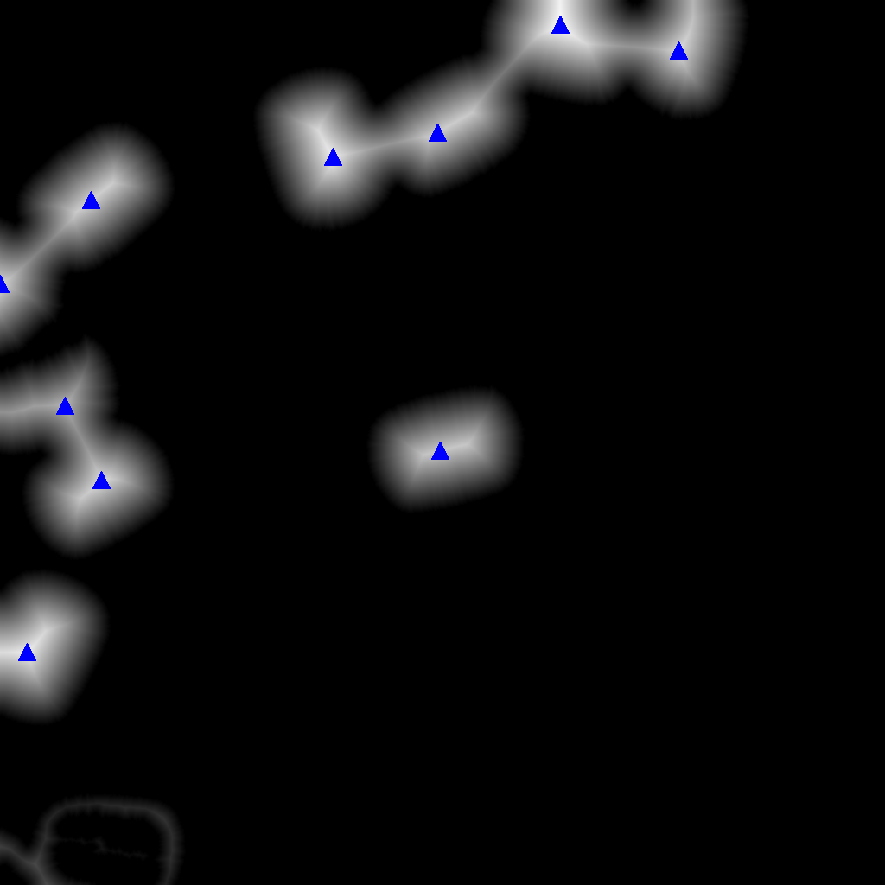
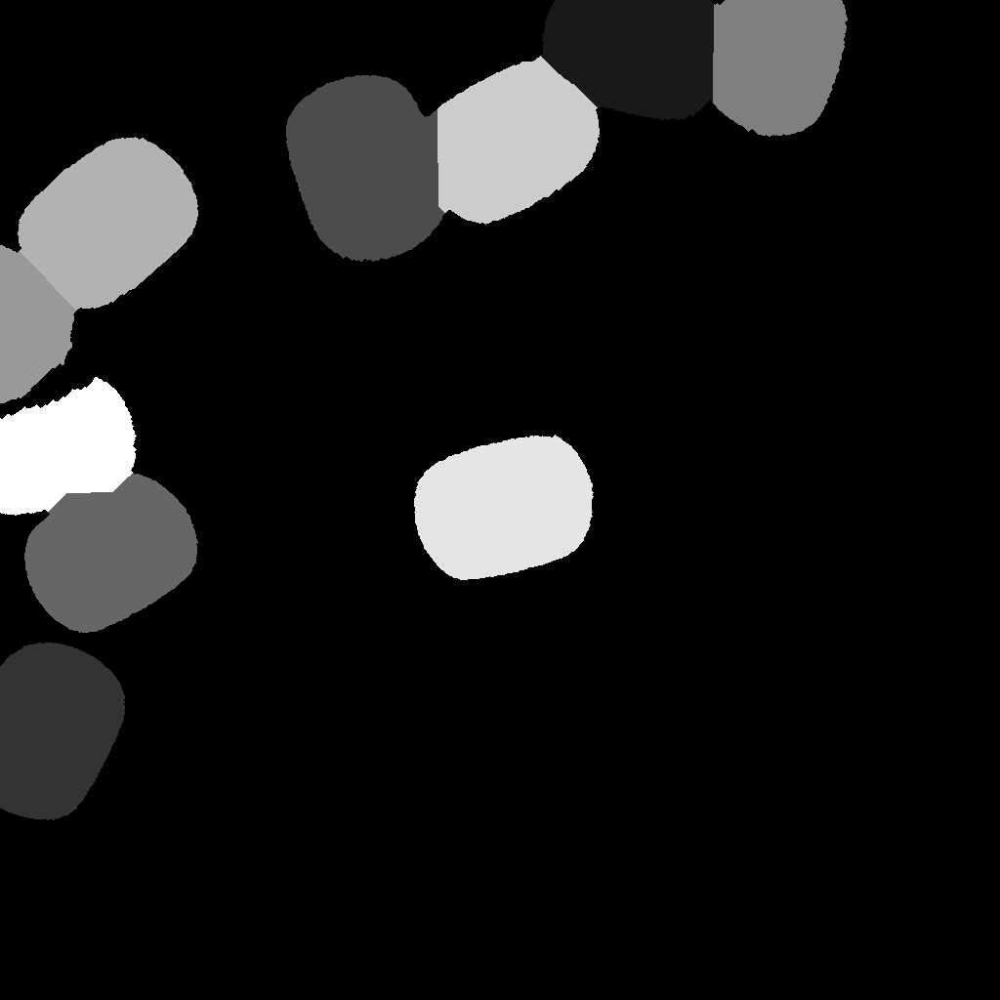
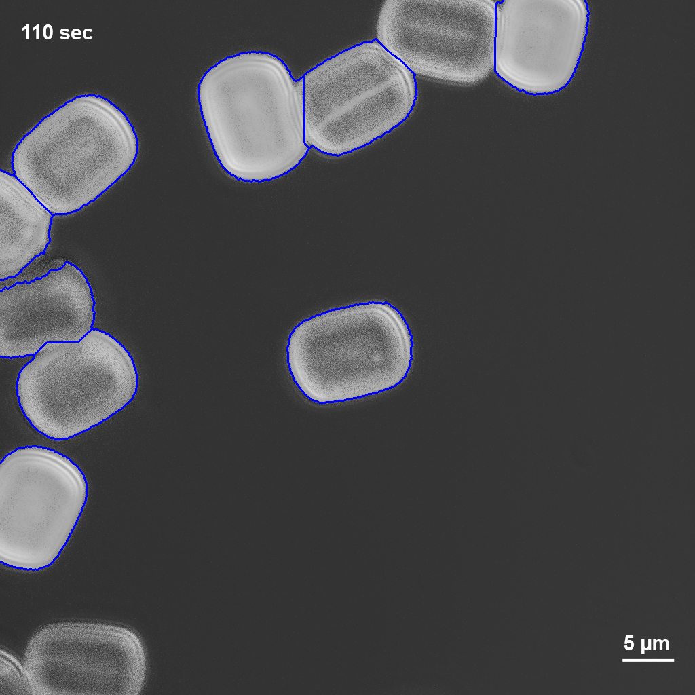
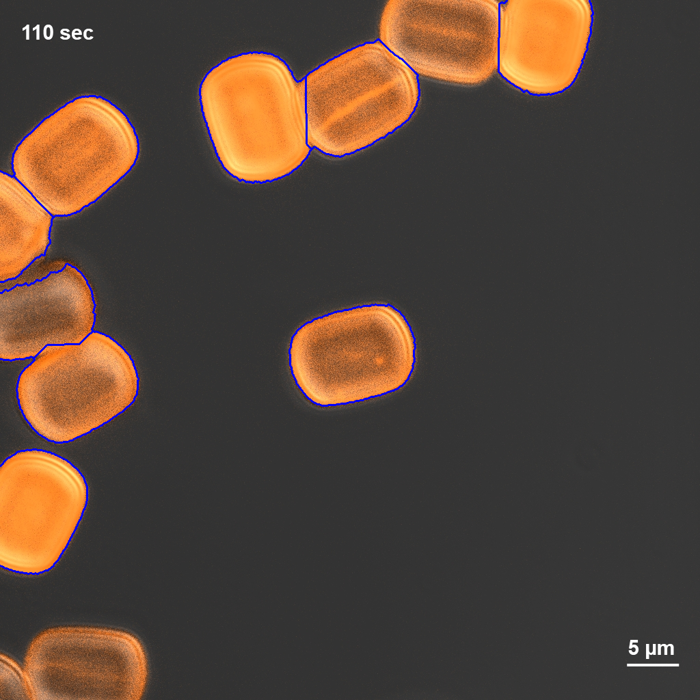

# 粒子分割分析工具 (Particle Segmentation Tool)

用于分析显微镜图像中化学粒子（晶体荧光）的计算机视觉项目。该工具能够自动检测、分割和测量图像中的粒子尺寸。

## 项目结构

```
particle-segment/
├── script/                  # 核心代码和详细文档
│   ├── README.md           # 详细代码文档
│   ├── main.py             # 主程序文件
│   ├── out_particles.json  # 输出结果文件
│   └── debug_overlay/      # 调试图像输出目录
├── samples/                # 示例数据
│   └── samples/            # 示例图像文件
│       ├── FM_t01.jpg
│       ├── FM_t10.jpg
│       └── FM_t23.jpg
└── README.md               # 项目概述（本文件）
```

## 主要开发人员

- 项目维护者：Dr. Zhang Ziyang

## 快速开始

1. 查看 `script/README.md` 获取详细使用说明
2. 运行主程序：`cd script && python main.py`

## 处理效果展示

以下是三个示例图像的处理结果对比：

| 样本 | 原图 | 分水岭标记点 | 分水岭分割 | 边界叠加（灰度） | 边界叠加（彩色） | 最终检测框 |
|------|------|-------------|-----------|------------------|------------------|------------|
| **FM_t01** |  |  |  |  |  |  |
| **FM_t10** |  |  |  |  |  |  |
| **FM_t23** |  |  |  |  |  |  |

## 许可证

本项目仅用于学术研究和教育目的。
