# 粒子分割分析工具 - 详细文档

## 功能特性

- **图像分割**: 使用OTSU阈值、形态学处理和分水岭算法进行精确分割
- **粒子测量**: 自动计算粒子的长轴(a)和短轴(c)尺寸
- **比例尺检测**: 自动识别图像中的比例尺，计算像素-微米转换
- **时间标记**: 从文件名或OCR识别时间信息
- **调试可视化**: 生成详细的处理步骤图像，便于调试和优化

## 安装依赖

```bash
pip install opencv-python numpy scipy scikit-image
```

可选依赖（用于OCR时间识别）：
```bash
pip install pytesseract
```

## 使用方法

### 基本使用

1. 将你的显微镜图像放入 `../samples/samples/` 目录
2. 运行主程序：

```bash
python main.py
```

### 自定义参数

在 `main.py` 的 `if __name__ == "__main__"` 部分可以调整以下参数：

- `IN_DIR`: 输入图像目录
- `OUT_JSON`: 输出JSON文件路径
- `DEBUG_DIR`: 调试图像输出目录（设为None关闭调试输出）
- `time_roi`: 时间标记区域 (x, y, w, h)
- `scale_roi`: 比例尺区域 (x, y, w, h)
- `margin`: 边界过滤边距

## 输出格式

程序会生成一个JSON文件，包含每个图像的分析结果：

```json
{
  "now_time": "2025-12-24T01:07:32",
  "file": "FM_t01.jpg",
  "image_shape": {
    "height_px": 1024,
    "width_px": 1024
  },
  "time_mark": {
    "seconds": 0,
    "raw": "0 sec",
    "source": "ocr_or_filename"
  },
  "scale": {
    "real_um": 5.0,
    "bar_px": 75,
    "um_per_px": 0.06666666666666667
  },
  "particles": [
    {
      "label": 1,
      "x_px": 451.77,
      "y_px": 172.98,
      "a_px": 174.61,
      "c_px": 200.95,
      "a_um": 11.64,
      "c_um": 13.40,
      "area_px": 28150,
      "angle_deg": 86.19
    }
  ]
}
```

## 图像处理流程

1. **遮罩覆盖层**: 移除图像中的时间和比例尺标记
2. **中值滤波**: 去除椒盐噪声
3. **CLAHE**: 对比度受限自适应直方图均衡化
4. **阈值分割**: OTSU或三角法阈值分割
5. **形态学处理**: 去除小连通域，桥接缺口，填充孔洞
6. **分水岭分割**: 基于距离变换的精确分割
7. **粒子测量**: 计算每个粒子的尺寸和位置

## 调试功能详解

启用 `DEBUG_DIR` 后，程序会在调试目录生成13张详细的处理步骤图像。每张图都有特定的诊断意义，下面按处理顺序详细说明：

### 00_raw.png（原图）
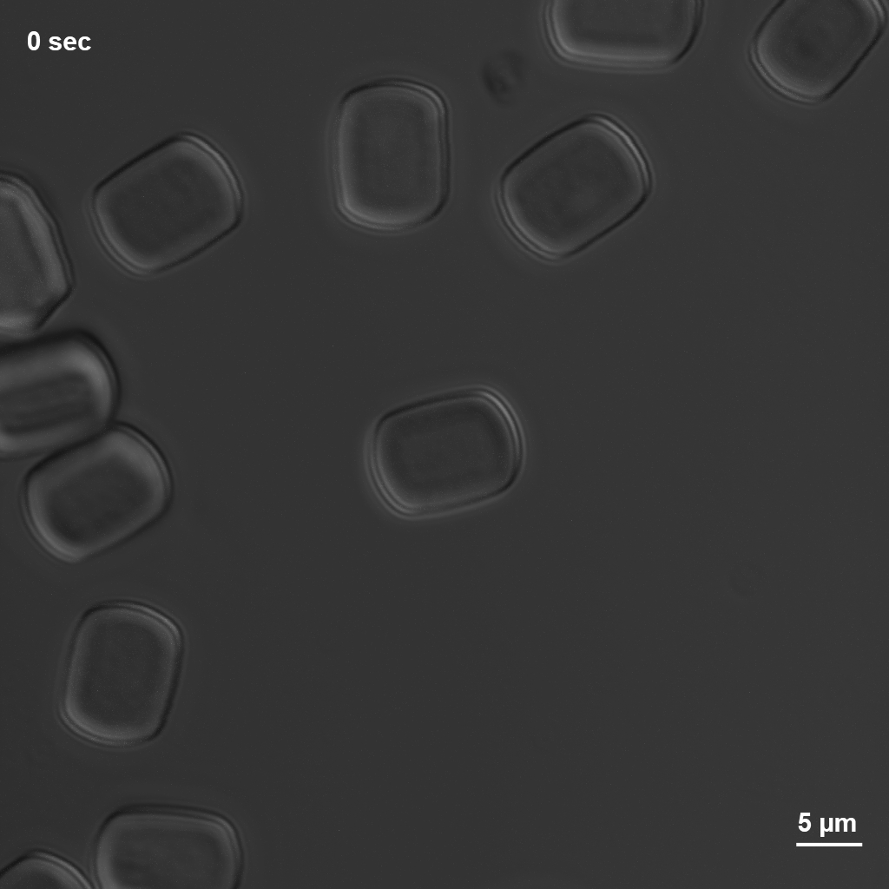

**要求**: 作为基准的输入灰度图，显示原始粒子边缘亮度、内部纹理和背景噪声水平。

**观察要点**:
- 粒子边缘是否足够亮
- 粒子内部纹理特征
- 背景噪声水平
- 时间和比例尺区域的位置

**注意**: 这张图不应被任何处理影响，是所有后续步骤的基准。

### 01_mask_overlays.png（遮挡时间/比例尺区域）


**要求**: 左上角时间区域和右下角比例尺区域被填成接近背景的中值灰度，但主体粒子区域完全不变。

**常见错误**:
- ROI选错 → 粒子被意外遮挡（导致漏检或形状缺损）
- ROI太小 → 时间/比例尺残留，影响后续阈值处理（出现异常白块）

**参数调整**:
- `time_roi`: 时间标记区域 (默认: (0, 0, 260, 140))
- `scale_roi`: 比例尺区域 (默认: (700, 820, 324, 204))

### 02_median_k3.png（中值滤波去噪）
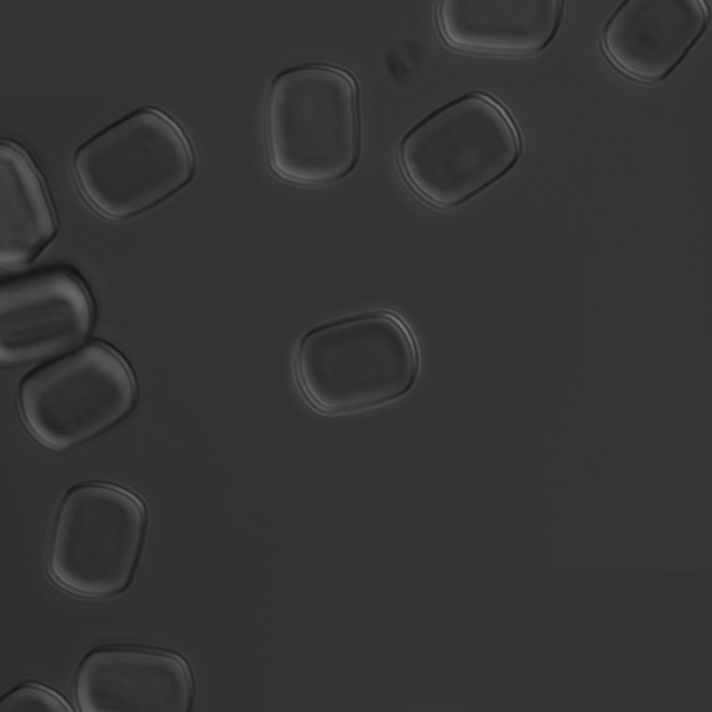

**要求**: 减少盐椒噪声，但保持粒子边缘清晰（中值滤波比高斯模糊更适合保留边缘）。

**常见错误**:
- 核大小太大 → 细边/细缝被抹平，影响后续分水岭分割

**参数调整**:
- `median_ksize`: 滤波核大小 (默认: 3，建议范围: 3-5)

### 03_clahe_clip0.1.png（CLAHE对比度增强）
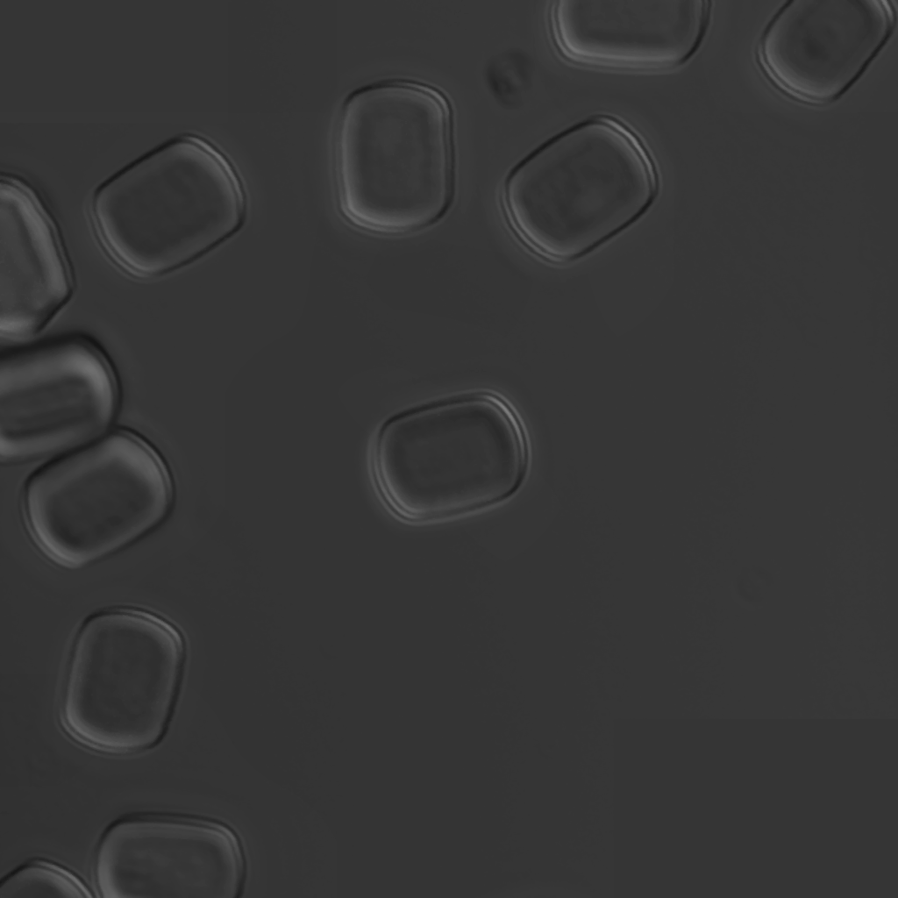

**要求**: 粒子边缘更突出，背景保持暗淡。不要过度增强导致背景变亮。

**常见错误**:
- clip值太大 → 背景也被抬亮，阈值后大片背景被误判为前景

**参数调整**:
- `clahe_clip`: CLAHE对比度限制 (默认: 0.1，建议范围: 0.1-1.0)

### 04_thr_otsu_*.png（阈值分割）
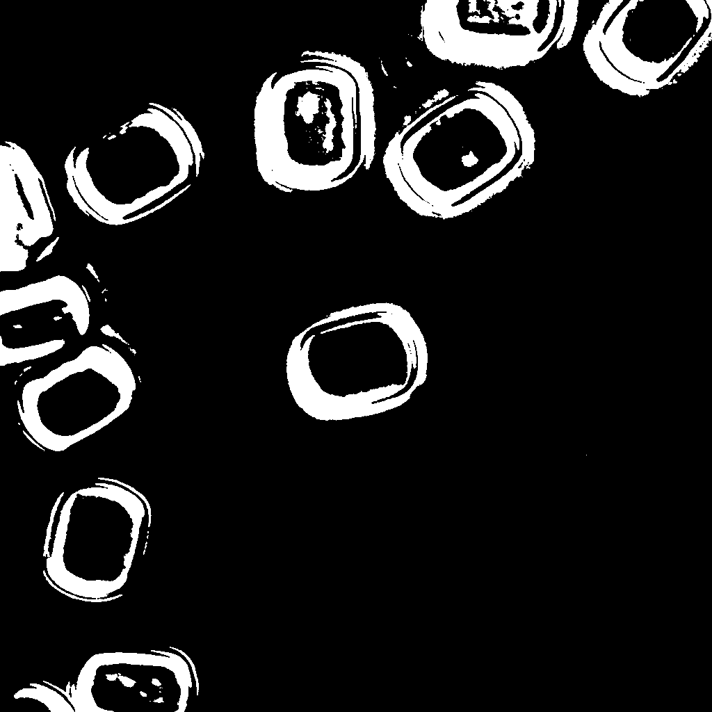

**要求**: 粒子呈白色前景，背景尽可能黑色。允许粒子内部有黑洞/纹理（后续会填充）。

**典型问题及对策**:

**"没压住白"（背景变白/大片白）**:
- 原因: 阈值太低或CLAHE过度增强背景
- 对策:
  - `thr_offset` 调负值（让阈值更高、更保守）
  - 或降低 `clahe_clip`
  - 如果启用 `auto_clip_white`，可降低 `fg_ratio_max` (0.10-0.15)

**"小点爆炸"（满屏白点）**:
- 原因: 阈值对噪声太敏感
- 对策: 主要靠下一步 `min_cc_area` 过滤，其次适当调高阈值

**粒子边缘断裂/漏检**:
- 原因: 阈值太高（太保守）
- 对策: `thr_offset` 调正值，或降低 `fg_ratio_min`

### 05_rm_small_cc_min800.png（去除小连通域）
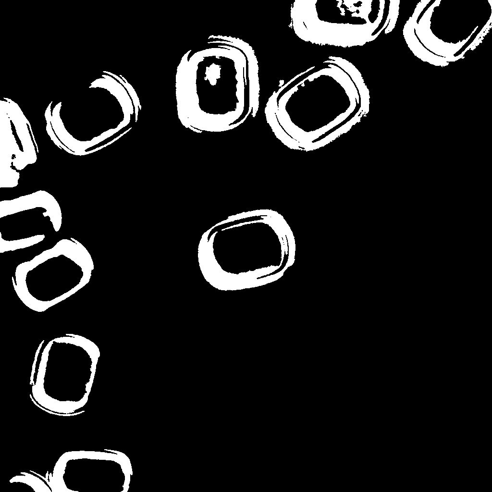

**要求**: 大幅减少背景小白点，保留粒子主体。允许轻微去除粒子毛边，但不能过度侵蚀粒子。

**常见错误**:
- 值太小 → 小点仍很多
- 值太大 → 粒子边缘被吃掉，小粒子消失

**参数调整**:
- `min_cc_area`: 最小连通域面积 (默认: 800，建议范围: 400-1200)

### 06a_keep_big_min3000.png & 06b_bridge_close_cross_k5_it2.png（桥接处理）

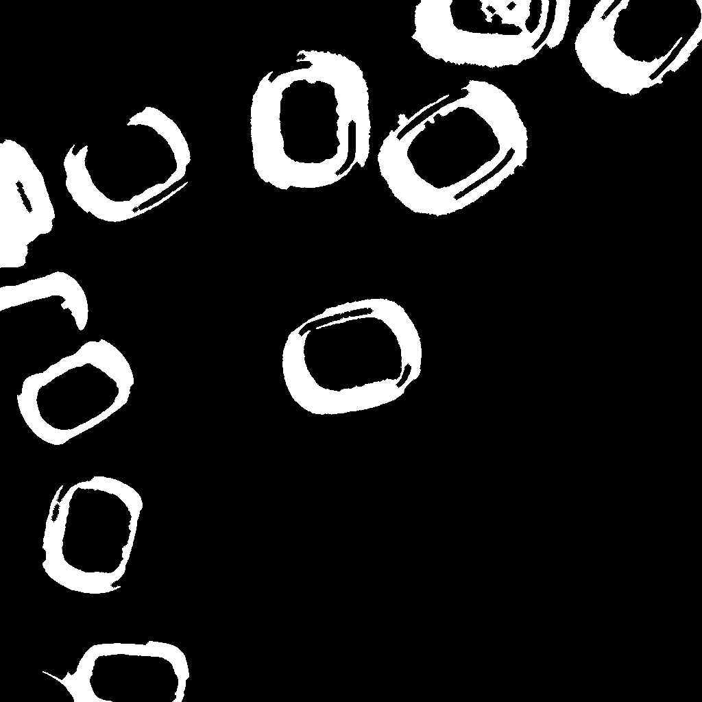

**要求**: 只对大颗粒进行桥接，修复边缘小缺口，避免噪声连片。

**参数调整**:
- `bridge_min_area`: 桥接最小面积 (默认: 3000)
- `bridge_kernel`: 桥接核大小 (默认: 5)
- `bridge_iter`: 桥接迭代次数 (默认: 2)

### 07_fill_holes_1.png（填充孔洞）
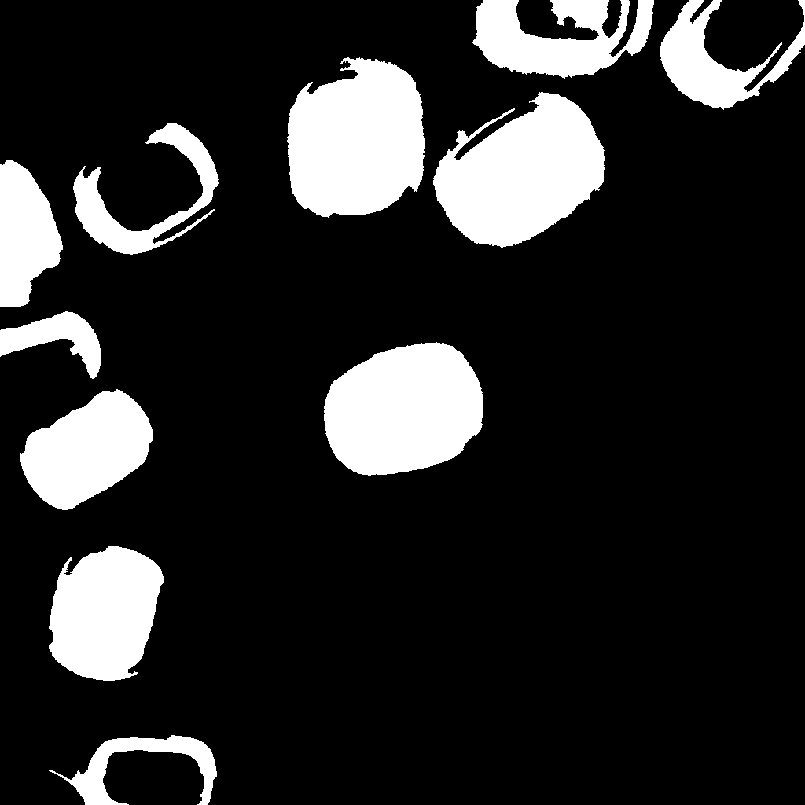

**要求**: 填充粒子内部黑洞，使粒子变为"实心"。前提是前面的04/05步骤已足够干净。

**常见错误**:
- 前景噪声太多 → 会填充环状噪声，使情况更糟

**参数调整**:
- `fill_holes`: 是否填充孔洞 (默认: True)

### 08_open_k3_it1.png（开运算去毛刺）


**要求**: 去除边缘毛刺和小突出，不要过度缩小粒子。

**常见错误**:
- 开运算太强 → 粒子边缘被削薄，影响分水岭效果

**参数调整**:
- `open_kernel`: 开运算核大小 (默认: 3，建议不超过5)
- `open_iter`: 开运算迭代次数 (默认: 1)

### 09_distance.png（距离变换）
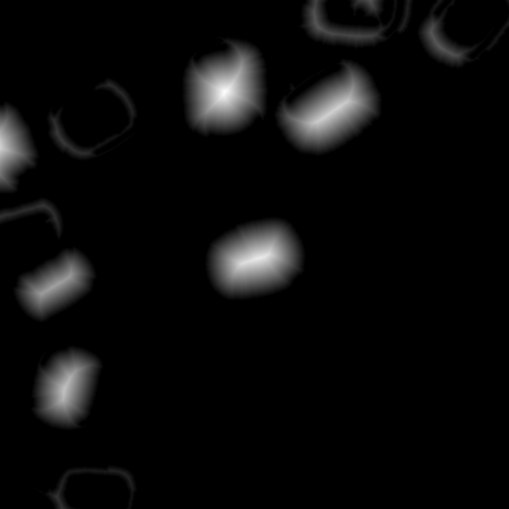

**要求**: 每个粒子内部形成"亮山峰"，中心亮边缘暗。粘连粒子应显示两个峰或马鞍形。

**常见错误**:
- 前景太碎/毛刺多 → 出现很多小峰，导致后续标记点爆炸

**诊断**: 如果这张图有问题，需回看04/05/08步骤。

### 10_markers_n6_md60_tr0.4.png（分水岭标记点）
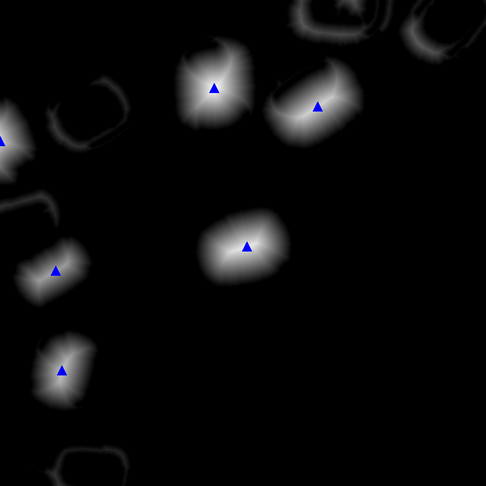

**要求**: 理想情况下每个粒子1个红色标记点。粘连时每个子粒子一个点。

**常见错误**:
- 标记点太多 → 一个粒子被过度分割
- 标记点太少 → 粘连拆不开，甚至整片变一个label

**参数调整**:
- 点太多: 增加 `ws_min_distance` 或 `ws_threshold_rel`
- 点太少: 减少 `ws_min_distance` 或 `ws_threshold_rel`

### 11_watershed_labels_k6.png（分水岭分割结果）
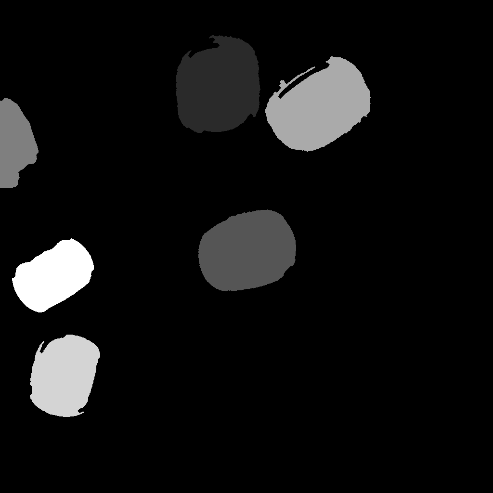

**要求**: 每个粒子一个连通的label区域，粘连处被正确切开。

**常见错误**:
- label太多碎块 → 标记点过多或前景太毛刺
- label太少 → 标记点过少或前景过度连通

**诊断**: 问题出现时需回看10_markers、08_open、04_thr步骤。

### 12_edges_on_raw.png & 13_edges_on_raw_bgr.png（边界叠加）
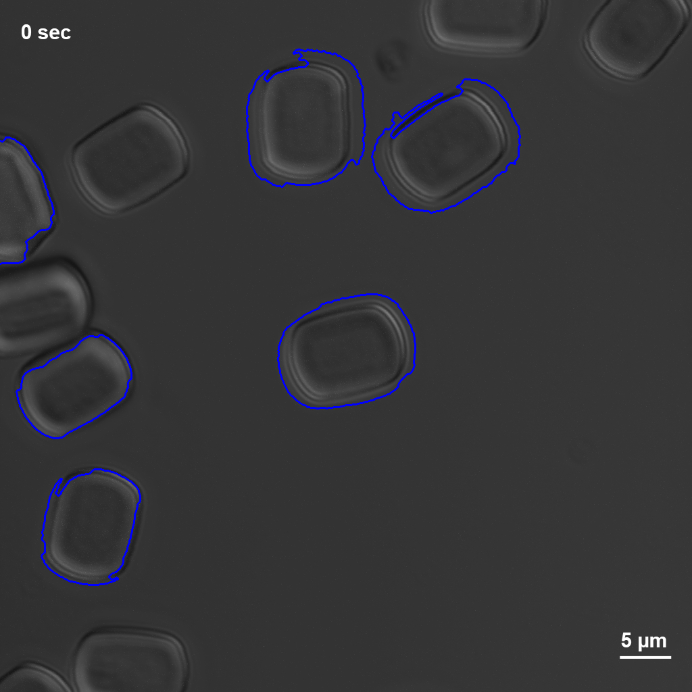
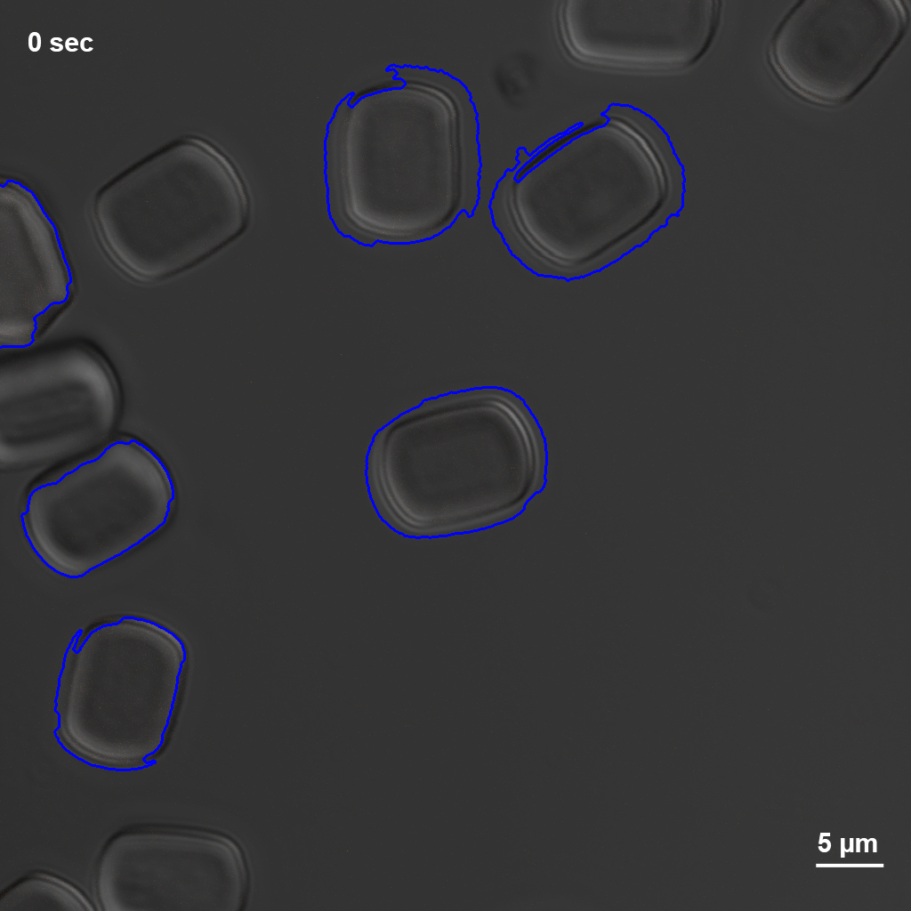

**要求**: 蓝色边界紧贴粒子外轮廓，每个粒子形成完整闭合边界。

**观察要点**:
- 是否有漏检粒子（无边界）
- 是否错误分割背景（说明04/05步骤不干净）
- 粘连处是否正确切开

### 最终检测框 (boxes_alllabels.png)
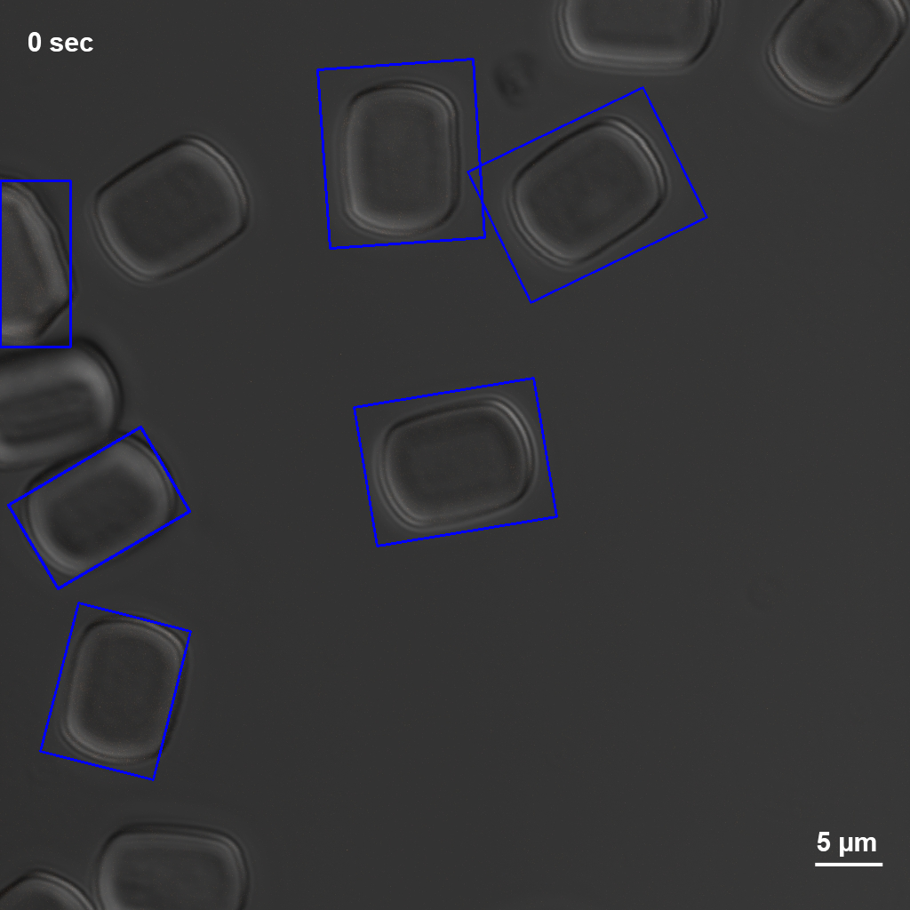

**要求**: 每个保留粒子被红色最小外接矩形框包围，框角度合理且尺寸贴合。

**常见错误**:
- 框太大 → 分割时包含过多背景
- 框太少 → `min_area` 或 `margin` 过滤过度

## 参数调整建议

### 对于不同类型的图像，可能需要调整：

- **阈值偏移** (`thr_offset`): 正值降低阈值，负值提高阈值
- **最小连通域面积** (`min_cc_area`): 根据粒子大小调整
- **桥接参数**: `bridge_kernel`, `bridge_iter` 控制缺口填充
- **分水岭参数**: `ws_min_distance`, `ws_threshold_rel` 控制分割精度

### ROI区域调整：

- `time_roi`: 时间标记区域，通常在左上角
- `scale_roi`: 比例尺区域，通常在右下角

## 依赖库说明

- **OpenCV**: 图像处理基础库
- **NumPy**: 数值计算
- **SciPy**: 科学计算，距离变换
- **scikit-image**: 分水岭算法
- **Pytesseract**: OCR时间识别（可选）

## 注意事项

1. 图像文件名建议使用 `FM_t{序号}.jpg` 格式，便于时间序列识别
2. 确保图像中有清晰的比例尺用于像素-微米转换
3. 对于低质量图像，可能需要调整阈值和形态学参数
4. 调试模式会生成大量中间结果图像，有助于参数调优

## 主要函数说明

### `segment_particles()`
核心分割函数，包含完整的图像处理管道。

### `measure_ac()`
测量每个分割粒子的尺寸参数。

### `process_one()`
处理单张图像的完整流程。

### `process_folder()`
批量处理文件夹中的所有图像。

## 核心算法参数

### 预处理参数
- `median_ksize`: 中值滤波核大小（默认3）
- `clahe_clip`: CLAHE对比度限制（默认0.1）
- `clahe_grid`: CLAHE网格大小（默认8x8）

### 阈值参数
- `thr_method`: 阈值方法（"otsu" 或 "triangle"）
- `thr_offset`: 阈值偏移（默认10）
- `auto_clip_white`: 是否自动调整阈值（默认True）

### 形态学参数
- `min_cc_area`: 最小连通域面积（默认800）
- `bridge_min_area`: 桥接最小面积（默认3000）
- `bridge_kernel`: 桥接核大小（默认5）
- `bridge_iter`: 桥接迭代次数（默认2）

### 分水岭参数
- `ws_min_distance`: 最小距离（默认60）
- `ws_threshold_rel`: 相对阈值（默认0.4）

## 输出文件

- `out_particles.json`: 包含所有粒子的测量结果
- `debug_overlay/`: 调试图像目录（如果启用）
- 每个输入图像对应一个带边界框的叠加图像
